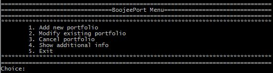

# BoujeePort
A simple system that holds information about the clients' security (stocks, bonds, etc.) portfolios to calculate the total charge for each client.

## Class Descriptions

### Security

An abstract class that holds the basics of stocks and bonds, such as:

* the company's name
* a single security's nominal value
* the number of securities bought by client
* the year of purchase

plus some virtual methods for calculating the annual charge of a security and displaying the information.

### Stock

Child class of Security, adding the information of the stock's price and implementing the methods described above.

### Bond

Child class of Security, adding the information of the bond's expiration date and interest rate and implementing the methods described above.

### Portfolio

Class to describe a portfolio of a client, holding information such as:

* the client's name
* the client' address
* the client's phone number
* the client's registration number

plus a vector with the securities the client has (that are being passed by reference in case of a future expansion where a client can sell some of its securities to another client), a boolean indicator that shows if the portfolio is or isn't valid and a number of methods to:

* calculate the total charge for the client
* cancel the portfolio
* check if there's at least one security with an annual charge bigger than a given amount (see below)
* add a security to the portfolio
* remove a security from the portfolio
* return the number of securities at the portfolio
* display the information of the portfolio

## Class Diagram

## Easin' it up

* all types of menus (main and subs) are concetrated to [menus.cpp](https://github.com/Coursal/BoujeePort/blob/master/menus.cpp)
* if-else instead of switch-case for better and simpler code
* initializing ten (10) portfolios for testing purposes
* use of a client's registration number as a reference for uniqueness in relation to other clients
* looping the main menu display to choose several function in a session
* attachment of two (2) files named [ABC1234ZXC](https://github.com/Coursal/BoujeePort/blob/master/ABC1234ZXC) and [Q111Q111](https://github.com/Coursal/BoujeePort/blob/master/Q111Q111) to test the direct securities loading from file by adding a new 

## Program Guide

The application starts with the main menu that waits for the user's selection. 

In case of entering an input different from the predefined ones (1-5), the menu reappears after an error message:

Below are detailed explanations for each of the available choices.

### Add new portfolio

Importing a new client's portfolio. Basic info is given by the keyboard and the user is asked if he/she wants to load the securities directly (via a file with the same name as the client's registration number). The import is complete when the portfolio is being displayed on the screen.

In both cases, the data that are being printed are from a temporary object that ceases to exist after the end of this operation, while a dynamic object with the same exact items is added to the list of portfolios in the system.

In the case of the direct loading of the securities, the lines of the file are scanned and a new dynamic object is created for each one of them (by erasing the delimiter `|` between the data of a security and then adding them to the portfolio's list of securities). 

In case of entering an input different from the predefined ones (`y`/`n`), an error message is printed.

### Modify existing portfolio

Modifying the basic info or adding/removing a security from an existing portfolio.

To remove a security, it is being checked if there are any securities at all for the current portfolio.

In case of entering an input different from the predefined ones (`1`/`2`/`3`), an error message is printed and the modification sub menu is being displayed again.

### Cancel portfolio

Cancelling a portfolio by setting the boolean indicator to show if it's valid or not to `0`.

In case of not finding the portfolio with a given registration number, an error message appears.

### Show additional info

Displaying statistics such as:

* the number of portfolios with a total charge of more than X euros
* the number of portfolios with a security with an annual charge over X
euros
* the ten (10) portfolios with the highest total charges

For the first two cases portfolios or securities that fulfil the criteria are being counted while at the last one all of the portfolios are sorted in descending order and the first ten (10) of them are being displayed by their registration numbers.

### Exit

Termination of the application.

